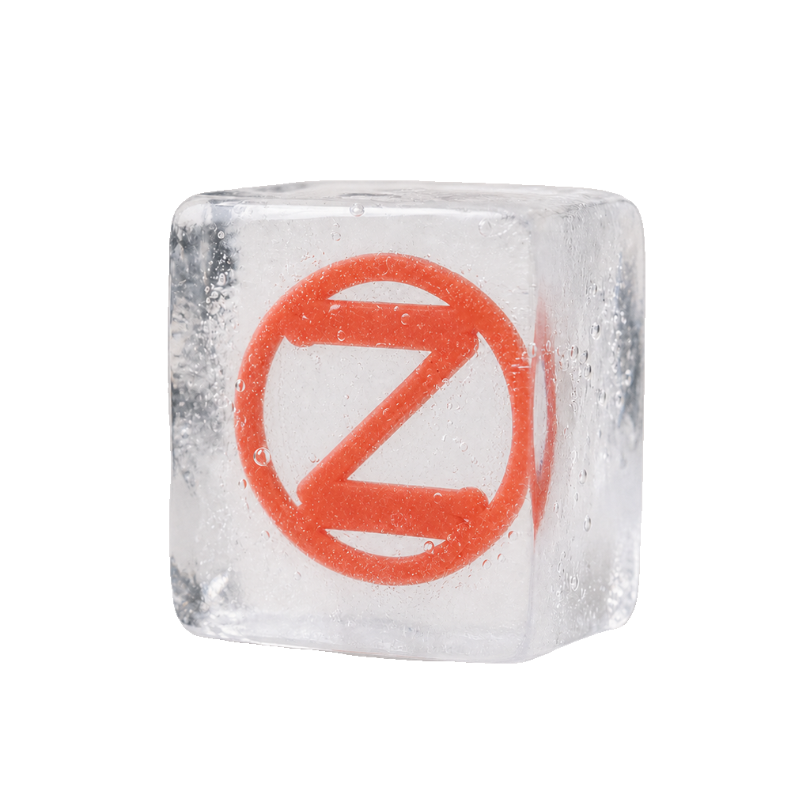

  

<h1 align="center">Zwei</h1>

Zwei 是一个帮你决定吃什么的小程序。场景化推荐、菜谱和烹饪指引、收藏、历史记录、购物清单、饮食偏好——把这些攒到一块，让每一餐都更省心，也更值得期待。默认面向抖音小程序，微信、支付宝、H5 作为兼容构建保留。

Zwei is a mini-program for figuring out what to eat: contextual recommendations, recipes and cooking guidance, favorites, history, shopping lists, and dietary preferences in one place. It targets the Douyin mini-program by default, with WeChat, Alipay, and H5 kept as compatible builds.
